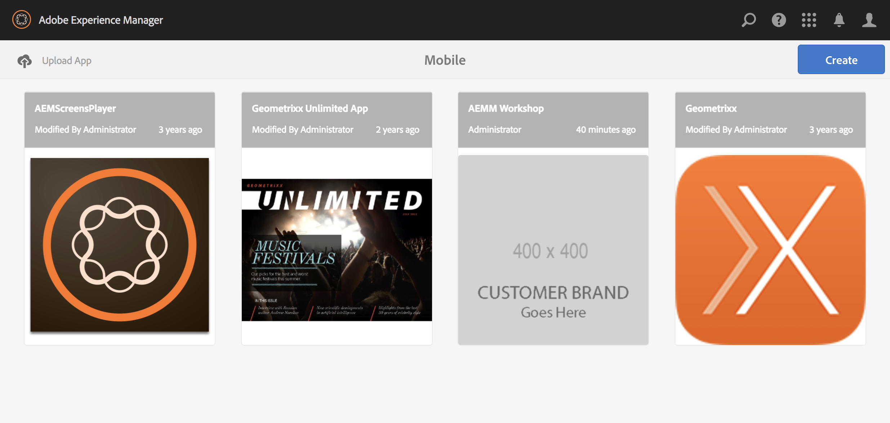

# Environment Setup


## Requirements Checklist

- [ ] <a href="https://docs.adobe.com/docs/en/aem/6-2/deploy/technical-requirements.html" target="_blank">AEM Technical Requirments</a>
- [ ] valid AEM `license.properties` file
- [ ] AEM 6.2 - author instance running on `:4502`
- [ ] Hotfix 12785 <a href="https://www.adobeaemcloud.com/content/marketplace/marketplaceProxy.html?packagePath=/content/companies/public/adobe/packages/cq620/hotfix/cq-6.2.0-hotfix-12785" target="_blank">CQ-6.2.0-HOTFIX-12785</a> - install this before SP1
- [ ] AEM 6.2 <a href="https://www.adobeaemcloud.com/content/marketplace/marketplaceProxy.html?packagePath=/content/companies/public/adobe/packages/cq620/servicepack/AEM-6.2-Service-Pack-1" target="_blank">Service Pack 1</a>
- [ ] AEM 6.2 <a href="https://www.adobeaemcloud.com/content/marketplace/marketplaceProxy.html?packagePath=/content/companies/public/adobe/packages/cq620/cumulativefixpack/AEM-6.2-SP1-CFP7" target="_blank">Cumulative Fix Pack SP1-CFP7</a> 
- [ ] AEM Mobile API `Client ID` and `Client Secret` (<a href="https://helpx.adobe.com/digital-publishing-solution/help/configure-aem.html" target="_blank">further details</a>)
- [ ] AEM Mobile `Device ID` and `Device Token` (<a href="https://aex2.aemmobile.adobe.com/aex/index.html" target="_blank">generate here</a>)
- [ ] Apache Maven - `version >= 3.2.5`


## Local AEM Instance

1. Start up your AEM author instance instance locally on port `:4502`
	- scripts have been included for [OS X](scripts/run.sh) and [Windows](scripts/run.cmd)
2. From the <a href="http://localhost:4502/crx/packmgr/index.jsp" target="_blank">Package Manager</a>, upload and install `Hotfix 12785`
3. Restart the author instance
4. Upload and install `Service Pack 1`
5. Upload and install `Cumulative Fix Pack SP1-CFP7`


## AEMM Workshop Content Installation

1. Using the terminal (or command line) on your machine, navigate to the `aemm-source-code/` directory.
2. Install the AEMM Workshop source with one Maven command:
```
	mvn -PautoInstallPackage clean install
```
Further details on the AEM project are included in the [README](../aemm-source-code/README.md).

Once the app has been successfully installed, you should have an entry for it listed in the <a href="http://localhost:4502/aem/apps.html/content/phonegap" target="_blank">AEMM console</a>:



***

| Previous      |         Next |
| :------------ | ------------:|
| [⇦ Workshop description](../README.md) | [Component Development ⇨](2_component_development.md) |