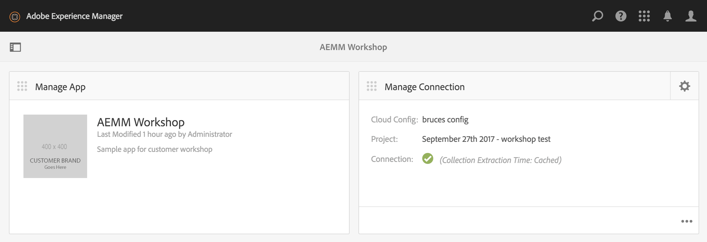
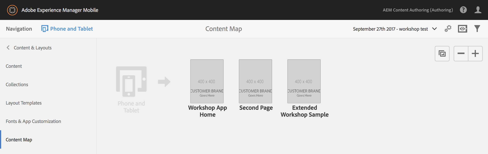
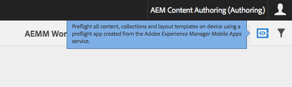
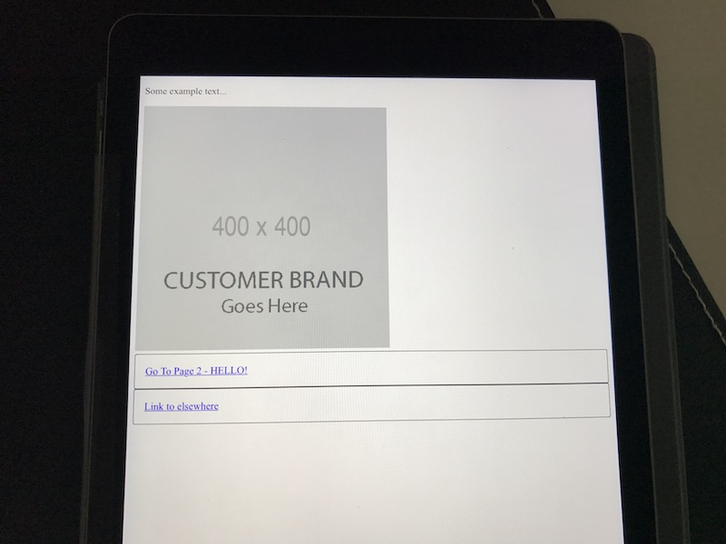

# Publishing to Mobile On-Demand Services (MODS)

## Configuration

### Configure your connection to AEM Mobile On-Demand Services.

1. Navigate to the AEM System Console, <a href="http://localhost:4502/system/console/configMgr" target="_blank">OSGi Configuration page</a>.
2. Find the entry for `Experience Manager Mobile On-demand Services Client`.
3. Click the pencil button to edit it's configuration.
4. In the `Client Id` field, enter your API Client ID.
5. In the `Client Secret` field, enter your Client Secret.
6. Click Save to persist your changes.

### Next, link up the app to On-Demand Services.

1. Open the AEMM Workshop <a href="http://localhost:4502/libs/mobileapps/admin/content/dashboard.html/content/mobileapps/aemm-workshop-sample" target="_blank">app's dashboard</a>
2. From the Manage Connection tile, tap the Gear icon in the top right of the tile.
3. Use the wrench button to add a new AEM Mobile cloud service configuration.
4. In the tab that opens up, tap the `+` next to "Available Configurations" to add a new configuration.
5. Give the new config a title, and tap Create.
6. Enter your `Device Id` and `Device Token` values when prompted. 
7. Tap "Test Device Configuration", then OK (twice) if successful. (did "Test Device Configuration" fail? You can generate these values again here: <a href="https://aex2.aemmobile.adobe.com/aex/index.html" target="_blank">aex2.aemmobile.adobe.com</a>. Use your `Client Id` when prompted.)
8. Close the browser tab detailing your new config.

### Pair the app with a project in MODS

1. Back in the AEMM Workshop app dashboard, the "Configure Experience Manager Mobile" popup should be displayed.
	- if not, simply tap the gear icon in the top right of the Manage Connection tile
2. From the "Select an Experience Manager Mobile Cloud Config" dropdown, select the configuration you created above.
3. From the "Select an Experience Manager Mobile Project", select the project you have created on the On-Demand side.
	- If needed, you can create a new, empty project at <a href="https://aemmobile.adobe.com" target="_blank">aemmobile.adobe.com</a>
4. Tap Update to connect your AEM project with the On-Demand project.

Once configured, your AEMM Workshop app's dashboard should look as follows:

With this one-time setup out of the way, you're ready to publish!

## Upload app pages

From the AEMM Workshop <a href="http://localhost:4502/libs/mobileapps/admin/content/dashboard.html/content/mobileapps/aemm-workshop-sample" target="_blank">app's dashboard</a>, locate the "Manage Articles" tile. Tap the ellipsis (...) icon at the bottom right of the tile to expand the tile.

1. With no articles selected, tap "Upload Shared Resources" to upload the shared client library content
	- exactly what gets included can be configured using Content Sync with <a href="/etc/contentsync/templates/aemm-workshop-sample/dps-HTMLResources" target="_blank">this resource</a>
2. Tap "Upload Shared HTML Resources" to proceed. In the dialog that appears, tap "Upload Shared HTML Resources". You may have to wait a few seconds for the upload to complete.
3. Using each article's thumbnail image, select the articles you wish to upload to On-Demand Services.
4. Locate and tap the Upload button in the header (only appears when one or more articles are selected).
	- exactly what gets uploaded with each article can be configured using Content Sync with <a href="http://localhost:4502/crx/de/index.jsp#/etc/contentsync/templates/aemm-workshop-sample/dps-article" target="_blank">this resource</a>
5. Tap Upload to proceed. Your upload may take a minute or two depending on number of articles, the assets they contain, and network conditions.

## Configure the Top Level article

We need to set which article will be displayed when our user's first open the app.

1. Navigate to the <a href="https://aemmobile.adobe.com/signin/index.html" target="_blank">AEMM On-Demand Services</a> app and log in.
2. Tap "Content & Layouts" from the left rail.
3. Using the dropdown in the middle of the header, ensure you are viewing the app you have paired within AEM. In my case, I named this app "September 27th 2017 - workshop test".
4. Tap "Content Map" in the left rail.
5. Drag and drop the articles you wish to include in your app to the droppable area next to the "Phone and Tablet" image.

The first article you have listed will become the Top Level article of your app. Siblings to this article will be accessible by swiping, or via links in the page content. In my case, I have 3 articles which I have set up like so:

## Preflight

The simplest path to seeing this content on a real device is to download the "AEM Preflight" app (available for iOS and Android), and sign in with the same credentials you use on aemmobile.adobe.com.

1. From the "Content Map" view on aemmobile.adobe.com (pictured above), tap the Preflight icon:

2. In the AEM Preflight app on your device, "pull to refresh" the app list.

3. Tap your app to view it in Preflight:

| Previous      |
| :------------ |
| [⇦ Template Development](4_template_development.md) |
